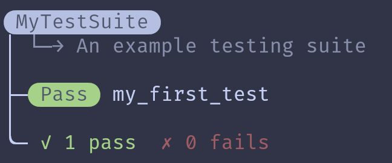

# PySoaper
Soaper is a testing framework for Python that is loosely based on Jest. It's had a few changes to fit python better, namely limiting the use of anonymous functions. A few personal touches have been added as well.

This is not gauranteed to get future support. This is a one-time personal project and might be abandoned at any point.

# Installation
To install soaper with pip, run the following command:
```sh
pip install git+https://github.com/BlueishSapphire/PySoaper.git
```

# Usage
Soaper is organized into test suites that contain individual tests. All test suites must be classes that inherit from the `TestSuite` class. Making a new test suite is quite simple:

```py
from soaper import TestSuite


class MyTestSuite(TestSuite):
	"""Here's where the description goes"""

	# your tests go here
```

Now this isn't very useful on its own. We need to know how to make the individual tests as well. Fortunately, making a test is also quite simple, you just need to add a method to your test suite that has the `@test` decorator. So, extending the previous example, you could add a test like so:

```py
from soaper import TestSuite, test


class MyTestSuite(TestSuite):
	"""An example testing suite"""

	@test
	def my_first_test():
		print("Hello, world!")
```

But this still doesn't have much functionality. We need assertions, and test cases, and all that other stuff that makes the tests actually useful. The main way to do this is using the `expect` class. The `expect` class has a few static methods, but the main way to interact with it is by providing a value to its constructor. Once you have an `expect` object with a value placed inside of it, you can run tests on that object. In the following example, we run a simple test that should always pass:

```py
from soaper import TestSuite, test


class MyTestSuite(TestSuite):
	"""An example testing suite"""

	@test
	def my_first_test():
		expect(True).to_not_equal(False)
```

But if you run this code, you'll notice that it doesn't give any output. This is because soaper doesn't automatically run the tests, you have to manually tell it to. You can use the `.run()` method of your test suite, or you could use `TestSuite.run_all()` to run all currently loaded test suites.

```py
if __name__ == "__main__":
	# because only one test suite is loaded, thsese are both the same

	MyTestSuite.run()

	TestSuite.run_all()
```

Here is the finished code:

```py
from soaper import TestSuite, test, expect


class MyTestSuite(TestSuite):
	"""An example testing suite"""

	@test
	def my_first_test():
		expect(True).to_not_equal(False)


if __name__ == "__main__":
	MyTestSuite.run()
```

Now you'll get the following output if you run this script:



(This script is available in [example.py](example.py))

# Reference

## **`TestSuite`**

### *`(static)`*` TestSuite.`**`run_all`**`()`
- Run all currently loaded test suites

### *`(static)`*` TestSuite.`**`run`**`(suite)`
- Run the given test suite


## subclasses of **`TestSuite`**

### `TestSuite.`**`run`**`()`
- Run the current test suite


## **`@test`**

Example:
```py
@test
def passing_test():
	pass

@test.failing
def failing_test():
	expect.fail()

@test.skip
def skipped_test():
	print("This will never run")
```

### `test(func)`
- Makes the given method into a test.

### `test.`**`failing`**`(func)`
- Makes the given method into a test, and marks it as failing. A test marked as failing has its result flipped: if it passes then it will show up as a fail and vice versa.

### `test.`**`skip`**`(func)`
- Makes the given method into a test, and marks it to be skipped. A test marked as skipped will not be run when the test suite is ran.

## **`expect`**

### *`(static)`*` expect.`**`fail`**`(msg: str = "Explicit failure")`
- Fail the current test with the given message.

### *`(static)`*` expect.`**`fail_if`**`(condition: bool, msg: str = "Explicit failure")`
- Fail the current test with the given message if the condition is true.

### *`(static)`*` expect.`**`with_stdin`**`(text: str)`
- Pass the given text to stdin for the code wihin this block.

Example:
```py
with expect.with_stdin("Hello, world!\n"):
	print(input()) # Hello, world!
```

### *`(static)`*` expect.`**`to_give_stdout`**`(text: str)`
- Fail the current test if the code within this block does not print the expected string to stdout.

Example:
```py
with expect.to_give_stdout("Hello, world!\n"):
	print("Hello, world!")
```

### *`(static)`*` expect.`**`to_raise`**`(kind: any)`
- Fail the current test if the code within this block does not raise the expected error type.

Example:
```py
with expect.to_raise(NameError):
	print(a_variable_that_does_not_exist)
```

### *`(static)`*` expect.`**`to_not_raise`**`(kind: any)`
- Fail the current test if the code within this block raises the given error type.

Example:
```py
with expect.to_not_raise(TypeError):
	for i in possibly_an_iterator:
		print(i)
```

### `expect.`**`truthy`**`()`
- Fail the current test if the value is not truthy.

### `expect.`**`falsy`**`()`
- Fail the current test if the value is not falsy.

### `expect.`**`to_equal`**`(value: any)`
- Fail the current test if the given value does not equal the expected value. (using the `==` operator)

### `expect.`**`to_not_equal`**`(value: any)`
- Fail the current test if the given value does equal the expected value. (using the `!=` operator)

### `expect.`**`to_be`**`(value: any)`
- Fail the current test if the given value is not the expected value. (using the `is` operator)

### `expect.`**`to_not_be`**`(value: any)`
- Fail the current test if the given value is the expected value. (using the `is not` operator)

### `expect.`**`less_than`**`(value: any)`
- Fail the current test if the given value is not less than the expected value. (using the `<` operator)

### `expect.`**`less_than_or_equal`**`(value: any)`
- Fail the current test if the given value is not less than or equal to the expected value. (using the `<=` operator)

### `expect.`**`greater_than`**`(value: any)`
- Fail the current test if the given value is not greater than the expected value. (using the `>` operator)

### `expect.`**`greater_than_or_equal`**`(value: any)`
- Fail the current test if the given value is not greater than or equal to the expected value. (using the `>=` operator)

### `expect.`**`close_to`**`(value: any, precision: int = 2)`
- Fail the current test if the given value is not close to the expected value (not within `precision` decimal places).

Example:
```py
expect(3.14).close_to(math.pi)
```

### `expect.`**`to_be_type`**`(value: any)`
- Fail the current test if the expected value is not an instance of the given value.

Example:
```py
expect(1).to_be_type(int)
expect(1.0).to_be_type(float)
expect("").to_be_type(str)
```

### `expect.`**`to_have_attr`**`(name: str, value: any = None)`
- Fail the current test if the expected value does not have an attribute named `name`. If `value` is not `None`, then fail the current test if the attribute does not equal `value`.

Example:
```py
expect(list).to_have_attr("count")
```

## **`expect.function`**

Example:
```py
(expect.function(add)
	.describe("given {} and {} as arguments, returns {}")
	.run_with_cases(
		call_with(0, 0).returns(0),
		call_with(1, 1).returns(2),
		call_with(2, 2).returns(4),
	))
```

### `expect.function.`**`describe`**`(desc: str)`
- Give a description of what the given function should do. The description gets formatted using `str.format` and has the arguments and return value of the given case passed to it.

### `expect.function.`**`run_with_cases`**`(*cases: list[call_with])`
- Run the given function with each of the given cases, failing the test if any of the return values doesn't match.

## **`call_with`**

Example:
```py
(expect.function(add)
	.describe("given {} and {} as arguments, returns {}")
	.run_with_cases(
		call_with(0, 0).returns(0),
		call_with(1, 1).returns(2),
		call_with(2, 2).returns(4),
	))
```

### `call_with(*args, **kwargs)`
- Returns a new `call_with` object holding the given arguments.

### `call_with.`**`returns`**`(value)`
- Returns the `call_with` object holding the given return value.

